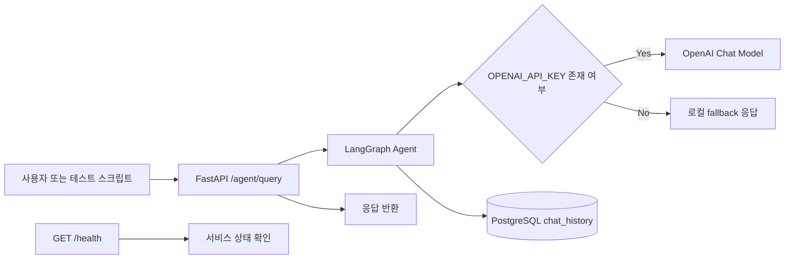

# SK Hynix AI Agent for Test Operation Efficiency

## 1. 문서 개요

본 문서는 `skh_ai_agent` 저장소의 현재 구현 상태를 기준으로 정리한 기업형 산출물이다. 프로젝트의 목적, 시스템 구성, 주요 기능, 운영 방식, 검증 항목, 향후 개선 방향을 한 문서에서 확인할 수 있도록 구성하였다.

## 2. 프로젝트 목적

본 프로젝트는 테스트 운영 업무의 응답성 향상과 반복 질의 자동화를 목표로 하는 AI Agent 기반 API 서비스를 제공한다. 사용자는 단일 엔드포인트를 통해 테스트 관련 질의를 전달하고, 시스템은 LLM 또는 로컬 대체 응답을 통해 결과를 반환하며, 질의 이력은 PostgreSQL에 저장된다.

## 3. 핵심 가치

- 테스트 운영 질의에 대한 표준화된 응답 제공
- FastAPI 기반의 경량 API 구조로 빠른 연동 가능
- PostgreSQL 기반 이력 저장으로 추적성 확보
- OpenAI API가 없어도 로컬 모드로 동작 가능한 검증 환경 제공
- Docker 기반 로컬 실행으로 개발 및 검증 절차 단순화

## 4. 시스템 범위

### 포함 범위

- `POST /agent/query` 기반 질의 처리
- `GET /health` 기반 상태 확인
- LangGraph 기반 에이전트 플로우
- PostgreSQL `chat_history` 저장소
- Docker Compose 기반 PostgreSQL 및 pgAdmin 환경
- DB 연결 점검 및 API 호출 테스트 스크립트

### 제외 범위

- 실제 사내 운영 데이터 연동
- 복잡한 권한 체계 및 사용자 인증
- 대규모 배치 처리 및 멀티테넌시
- 고급 관측성 스택(Prometheus, Grafana 등)

## 5. 전체 아키텍처

## 6. 주요 구성 요소

### 6.1 API 계층

- 파일: `app/main.py`
- 역할: FastAPI 애플리케이션 초기화, 라우팅, 헬스체크 제공
- 주요 엔드포인트:
  - `POST /agent/query`
  - `GET /health`

### 6.2 에이전트 계층

- 파일: `agents/test_agent.py`
- 역할: LangGraph 워크플로우 구성 및 응답 생성
- 동작 방식:
  - `OPENAI_API_KEY`가 있으면 OpenAI 모델 사용
  - 키가 없으면 로컬 fallback 응답 반환
  - 질의 및 응답을 PostgreSQL에 저장

### 6.3 데이터 계층

- 파일: `db/database.py`
- 역할: SQLAlchemy 엔진, 세션 팩토리, `ChatHistory` 테이블 정의
- 저장 항목:
  - `session_id`
  - `query`
  - `response`
  - `timestamp`

### 6.4 보조 도구

- 파일: `tools/test_tools.py`
- 역할: 테스트 목적의 예시 도구 제공
- 주의사항: 현재 구현은 샘플 수준이며, 실제 운영 연동용 로직은 별도 확장이 필요함

## 7. 실행 환경

### 필수 조건

- Python 3.10 이상
- Docker Desktop
- `uv` 또는 pip 기반 Python 환경

### 환경 변수

- `OPENAI_API_KEY`: OpenAI 응답 활성화용 키
- `DATABASE_URL`: PostgreSQL 접속 문자열

### 로컬 실행 흐름

1. Docker Compose로 PostgreSQL 및 pgAdmin 기동
2. `test_db.py`로 DB 연결 확인
3. `uvicorn`으로 API 서버 실행
4. `test_agent_api.py` 또는 직접 요청으로 기능 검증

## 8. 검증 항목

- DB 연결 성공 여부
- `chat_history` 테이블 생성 여부
- `/health` 응답 정상 여부
- `/agent/query` 질의-응답 정상 동작 여부
- OpenAI 미설정 시 로컬 fallback 응답 동작 여부

## 9. 운영 고려사항

- `.env` 및 `.venv`는 Git에 포함하지 않는다.
- 데이터베이스 스키마 변경 시 `test_db.py`로 사전 검증한다.
- 운영 환경에서는 응답 로깅, 예외 처리, 인증, 레이트 리밋을 추가하는 것이 바람직하다.
- 현재 구현은 내부 PoC 또는 초기 PoV 수준에 적합하며, 운영 서비스 전환 시 안정성 강화 작업이 필요하다.

## 10. 품질 및 리스크

### 확인된 장점

- 단순한 호출 경로로 이해와 유지보수가 쉽다.
- 로컬 fallback으로 개발 환경 독립성이 높다.
- DB 저장 구조가 단순하여 초기 확장이 쉽다.

### 개선 필요 사항

- 현재는 응답 저장이 신규 row insert 방식이므로 추후 질의-응답 단위 정규화가 필요하다.
- 인증/인가 계층이 없으므로 외부 노출 시 보안 보강이 필요하다.
- 장애 추적을 위한 구조화 로그와 모니터링이 부족하다.
- 실제 업무 데이터와의 연계 규칙이 아직 정의되지 않았다.

## 11. 향후 개선 과제

1. 질의와 응답을 분리한 정식 대화 세션 모델 도입
2. 사용자 인증 및 API 접근 제어 추가
3. 구조화 로그와 요청 추적 ID 도입
4. 운영용 설정 분리 및 비밀값 관리 강화
5. 실제 테스트 운영 지식 기반 응답 확장
6. 단위 테스트 및 통합 테스트 보강

## 12. 결론

본 프로젝트는 테스트 운영 효율화를 위한 AI Agent 기반 API의 최소 실행 가능 형태를 제공한다. 현재 구조는 빠른 PoC 검증과 내부 시연에 적합하며, 향후 보안, 관측성, 데이터 모델 정교화를 통해 사내 운영 수준으로 확장할 수 있다.